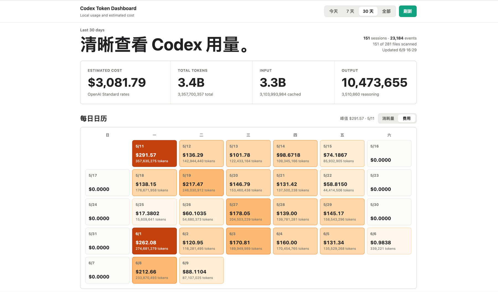

<h1 align="center">Codex Token Dashboard</h1>

<p align="center">
  A local dashboard for seeing your Codex token usage, daily burn, and estimated cost.
</p>

<p align="center">
  MIT licensed / Node.js 18+ / zero runtime dependencies / local-first
</p>

---

Codex Token Dashboard reads your local Codex Desktop / Codex CLI session logs and turns them into a small dashboard you can check every day.

It is built for the simple question: **how much am I actually using Codex, and what does that roughly cost?**

<p align="center">
  
</p>

## What You Get

| View | What it shows |
| --- | --- |
| Overview | Estimated cost, total tokens, input, cached input, output, and reasoning output |
| Daily calendar | A heatmap of each day's token usage or estimated cost |
| Model breakdown | Tokens and cost grouped by model |
| Distribution | Top model share and current range summary |
| Recent sessions | The sessions contributing to the selected range |

## Why

Codex already logs enough local usage data to build a useful dashboard. The hard part is usually not the code; it is making the time to build and maintain the little tool.

This project packages that daily dashboard into a local Node.js app:

- no database
- no external service
- no runtime dependencies
- no upload of session data

## Quick Start

```bash
git clone https://github.com/Soren083/codex-token-dashboard.git
cd codex-token-dashboard
npm start
```

Open:

```text
http://127.0.0.1:8766/
```

The app reads Codex session logs from:

```text
~/.codex/sessions
```

## Requirements

- Node.js 18 or newer
- Local Codex session logs under `~/.codex/sessions`

## Configuration

| Name | Default | Description |
| --- | --- | --- |
| `CODEX_TOKEN_DASHBOARD_HOST` | `127.0.0.1` | HTTP bind host |
| `CODEX_TOKEN_DASHBOARD_PORT` | `8766` | HTTP port |
| `CODEX_TOKEN_DASHBOARD_SESSIONS_ROOT` | `~/.codex/sessions` | Codex session log directory |
| `CODEX_TOKEN_DASHBOARD_PRICING_JSON` | unset | JSON object for overriding model pricing |
| `CODEX_TOKEN_DASHBOARD_CACHE_TTL_MS` | `10000` | In-memory metrics cache TTL |
| `CODEX_TOKEN_DASHBOARD_FILE_CACHE_ENTRIES` | `1000` | Max parsed file cache entries |

Example:

```bash
CODEX_TOKEN_DASHBOARD_PORT=9000 npm start
```

## macOS Service

Install as a user LaunchAgent:

```bash
npm run install-service
```

Uninstall:

```bash
npm run uninstall-service
```

The default LaunchAgent label is `io.github.soren083.codex-token-dashboard`. Override it with:

```bash
CODEX_TOKEN_DASHBOARD_LAUNCHD_LABEL=com.example.codex-token-dashboard npm run install-service
```

## Pricing

Cost is an estimate, not an official bill.

Pricing is calculated in USD per 1M tokens. `input_tokens` includes `cached_input_tokens`, so the dashboard estimates cost as:

```text
(input_tokens - cached_input_tokens) * input_rate
+ cached_input_tokens * cached_input_rate
+ output_tokens * output_rate
```

`reasoning_output_tokens` is displayed separately but not billed again because `output_tokens` is used for output billing.

The built-in table includes GPT-5 family rows and a few Codex aliases:

- `gpt-5.2-codex` maps to `gpt-5.2`
- `gpt-5-codex` maps to `gpt-5`
- `gpt-5.3-codex` is shown as token usage but left unpriced unless you provide an override

Use `CODEX_TOKEN_DASHBOARD_PRICING_JSON` when your local model names or pricing differ.

## Privacy

By default, the dashboard serves only on `127.0.0.1` and reads local files from your machine.

It does not upload usage data anywhere.

Be careful when binding to a public interface. Session metadata can include local paths, prompt-derived titles, model names, and usage details.

## Roadmap

This project starts with Codex local logs, but the long-term direction is broader agent and API usage visibility.

- [ ] Export daily usage as CSV/JSON
- [ ] Click a calendar day to inspect that day's sessions
- [ ] Filter by model, provider, and source
- [ ] Generic JSONL/CSV usage import
- [ ] Adapter interface for multiple usage sources
- [ ] API gateway integrations such as LiteLLM, OpenRouter, Helicone, and Langfuse
- [ ] Other desktop coding agents when local usage logs are available

The useful abstraction is a shared usage record:

```js
{
  source: "codex",
  provider: "openai",
  model: "gpt-5.5",
  timestamp: "2026-06-09T08:00:00.000Z",
  inputTokens: 1234,
  cachedInputTokens: 1000,
  outputTokens: 234,
  costUsd: 0.01,
  sessionId: "optional",
  title: "optional"
}
```

## Development

Run checks:

```bash
npm test
node --check server.mjs
```

The app intentionally has no runtime dependencies. Prefer plain Node.js and browser APIs unless a dependency clearly reduces maintenance risk.

## Contributing

Issues and PRs are welcome. Good contributions include:

- support for another usage log format
- improved model pricing aliases
- better cost estimation
- export and filtering workflows
- UI polish that keeps the dashboard quiet and readable

## License

MIT
